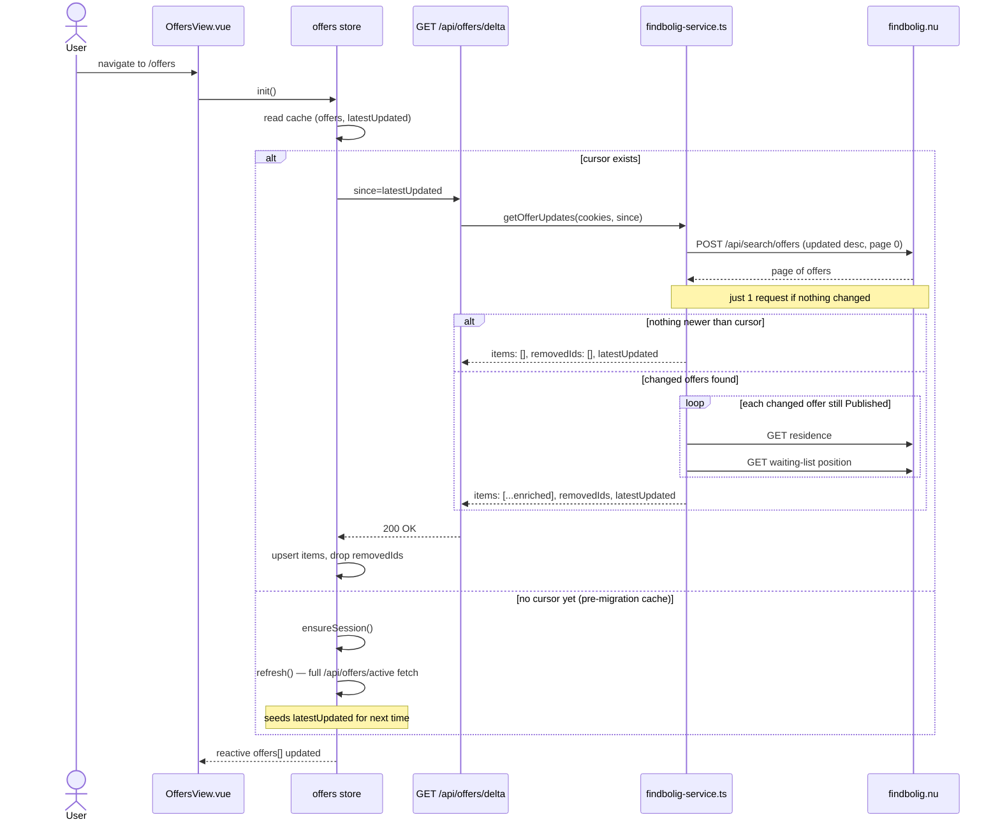
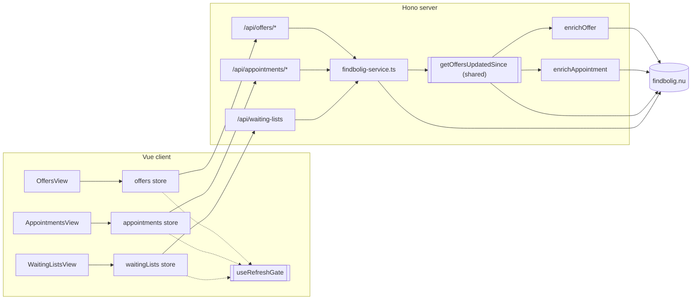
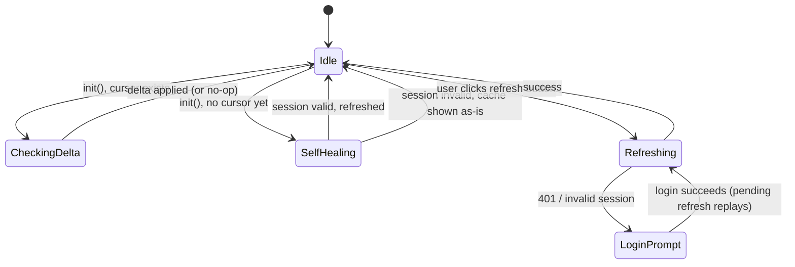
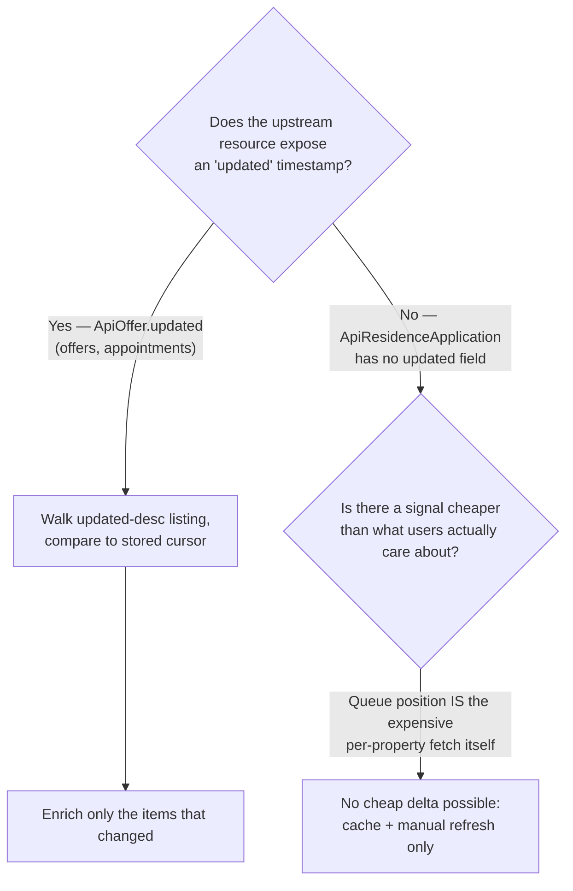

# Delta refresh — offers & appointments

Diagrams for the `feat/offers-delta-refresh` branch (issue #47). Covers the
navigation-triggered delta check, how it fits into the existing architecture,
the simplified store lifecycle (post `needsRefresh`/`sessionExpired` removal),
and why waiting lists deliberately did **not** get the same treatment.

## 1. Process timing — delta check on navigation

Same shape for `/offers` and `/appointments` (appointments swaps
`enrichOffer` for `enrichAppointment`, and the "Published" filter for
"Finished or Published").

## 2. Architecture — shared delta primitive

`getOffersUpdatedSince` is the one piece both offers and appointments walk
through; waiting lists never reaches it because its upstream data has no
`updated` cursor to walk (see diagram 4).

## 3. Store lifecycle (after removing `needsRefresh` / `sessionExpired`)

One login-prompt path for every "not authenticated" reason, instead of a
separate `sessionExpired` flag with its own banner.

## 4. Why waiting lists has no delta

